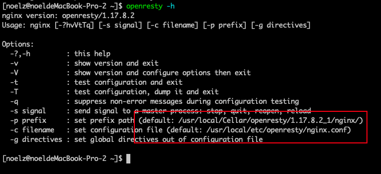

这段时间需要做一个签名验证的模块 . 因为 golang 的 rsa 性能问题需要用 nginx-opensty 来开发 , 在这个过程中遇到了一些问题和结果方法 , 在这里记录一下 .

## 安装

在 mac 下可以直接在 termina 中 `brew install openresty/brew/openresty` 来安装

安装后 operesty 的目录在 `/usr/local/Cellar/openresty/1.17.8.2_1` 下 , 最后是 openrsty 的版本号

nginx 配置文件的目录在 `/usr/local/etc/openresty/` 下

nginx 的日志文件在 `/usr/local/var/log/nginx/` 下

这些信息都可以使用`openresty -h` 来查看




安装好后可以直接用`openresty` 来启动

重载配置文件或停止 nginx 可以用 `openresty -s signal` 来实现 , 和 `nginx -s signal` 的效果是一样的


## hello world

nginx 的默认文件是 `/usr/local/etc/openresty/nginx.conf` 

修改该配置文件中的 `http` 块添加我们自己工作目录中的配置文件

 `include /Users/noelz/work/openresty/conf/*;`

然后在 `~/work/openresty/conf/` 下添加 `a.conf` 文件

```
server {
    listen       6622;
    set $path /Users/noelz/work/openresty/code;
    location / {
        default_type text/html;
        lua_code_cache off;
        access_by_lua_file $path/hellow_world.lua;
    }
}

```

在 `~/work/openresty/code/` 添加 `hellow_world.lua` 文件

```lua
ngx.say('hello world')
```

现在的 work 目录下的结构如下

├── code
│   └── hellow_world.lua
└── conf
    └── a.conf

重载配置文件 `openresty -s reload` 然后在浏览器中打开 `localhost:6622`


## openresty 的项目组织

稍微复杂的一点的功能都不可能是单文件 , 肯定要引用其他的模块 . 既然要引用其他模块 , 肯定要让 openresty 知道你的代码目录在哪 . `lua_package_path`  这个配置项就能完成这项功能

比如下面这个配置文件

```txt
lua_package_cpath '/luatrace/code/?.so;/data/code/?.so;;';
lua_package_path '/luatrace/code/?.lua;/data/code/?.lua;;';
init_by_lua_file /luatrace/code/service/conf.lua;
server {
    set $path /data/code/service;
    
    listen 80;
    location /get {
        default_type text/html;
        lua_code_cache off;
        access_by_lua_file $path/get.lua;
    }
}
```


这个配置的前两行制定了 lua 和 c 代码或资源库的加载路径

比如在 get.lua 文件中引入了其他的模块 , 可以这样来引入 `local signlib = require "service.sign"`

get.lua 和 sign.lua 的文件位置如下


## openresty 的加密库 lua_resty_nettle

因为我做的是签名验证相关的项目 , 肯定需要一些 sha256 或 hmac 之类的库 . 而**[ lua-resty-nettle](https://github.com/bungle/lua-resty-nettle)** 就是干这个的

如果用 openresty 的包管理器 opm 来安装一般不会遇到什么问题 , 但是一开始我是直接把 nettle 库的 lua 代码直接下载下来放到 openresty 的 lib 目录下 . 因为 nettle 库会引用 c 语言编译好的 .so 文件 , 所以还需要安装 c 语言版的 nettle . 直接使用 `brew install nettle` 来安装就行了


## openresty 中不同的阶段

在 openrest 中可以指定不同的加载阶段来执行不同的 lua 代码 

```
lua_package_cpath '/data/code/?.so;/data/code/?.so;;';
lua_package_path '/data/code/?.lua;/data/code/?.lua;;';
init_by_lua_file /data/code/service/conf.lua;
server {
    set $path /data/code/service;
    listen 80;
    location /a {
        access_by_lua_file $path/get.lua;
    }
    location /b {
        rewrite_by_lua_file $path/inflate_body.lua;
        access_by_lua_file $path/post.lua;
    }
}
```


* 第三行的 `init_by_lua_file`  是用来加载全局的配置文件的 , 在 openresty 刚启动的时候运行
* 第十一行的 `rewrite_by_lua_file` 通常是用来检查改写 URI 但也可以操作响应体 , 做编码解码工作 . 在这个示例中就是来解压 gzip 的
* 第八行和第十二行的 `access_by_lua_file` 就是来做主要的业务逻辑的 , 返回具体的相应内容

 

还有其他几个阶段 , 我这里没有用到 . 可以在这个[链接](https://wiki.shileizcc.com/confluence/pages/viewpage.action?pageId=47415936#id-5.%E5%BC%80%E5%8F%91%E6%A6%82%E8%BF%B0-%E6%89%A7%E8%A1%8C%E7%A8%8B%E5%BA%8F)找到更多的信息


## openresty 中的全局变量

在 openresty 启动的时候读取配置文件 , 把配置文件的配置项放到全局变量里 , 方便其他的模块来使用 . 

这种需求可以使用模块变量来解决 . 

定义在模块里面的变量称为模块变量。无论定义变量时有没有加 `local` ，有没有通过 `_M` 把变量引用起来， 定义在模块里面的变量都是模块变量 . 

比如在上面的配置文件的第三行中的 lua 代码就是读取了配置文件然后返回一个模块变量


```lua
local lfs = require("lfs")
local str = require "lib.str"

local conf = {}
local path = '/data/conf/'
for file in lfs.dir(path) do
    if string.match(file, '.json') then
        local key = str.split(file, '.')[1]
        file = io.open(path .. '/' .. file, "r")
        local content = file:read('*all')
        file:close()
        conf[key] = content
    end
end

return conf
```


然后在其他的模块中就可以引用上面的 `conf` 模块了

```lua
-- 引入 conf 模块 , 它就是个全局变量
local conf = require "service.conf"  

print(conf['xxx'])
```


## lua 的 split 和 hex

虽然 lua 中有 `string.gmatch` 这样万能的字符串操作库 , 但是我只是临时用下 lua , gmatch 这个函数我有点用不来 . 所以下面是我封装的字符串分割 , 以及字符串转 16 进制的两个函数

```lua
function split(inputstr, sep)
    inputstr = inputstr or ''
    if sep == nil then
        sep = "%s"
    end
    local t = {}
    for str in string.gmatch(inputstr, "([^" .. sep .. "]+)") do
        table.insert(t, str)
    end
    return t
end
```

```lua
function hex(str, spacer)
    return string.lower((string.gsub(str, "(.)", function(c)
        return string.format("%02X%s", string.byte(c), spacer or "")
    end)))
end
```

