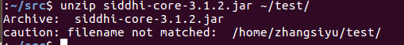
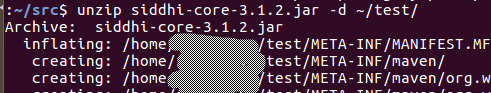

### zip命令
使用unzip的时候有时候想把文件解压到一个新的文件夹，如果直接写一个新目录会报错



在要解压的目的地的前面加个参数－d，就能新建一个不存的目录



***
### mysql相关命令
#### 自动补全
mysql的命令也是有自动补全的．需要的参数如下
```bash
mysql -u root -p --auto-rehash
```
开启后能自动补全了


但是这个只能补数据名和表名之类的，不能补全show databases 之类的命令，很蛋疼
#### 连接远程mysql
-h参数就是远程地址

```bash
mysql -h 192.168.1.221 -u root -p
```