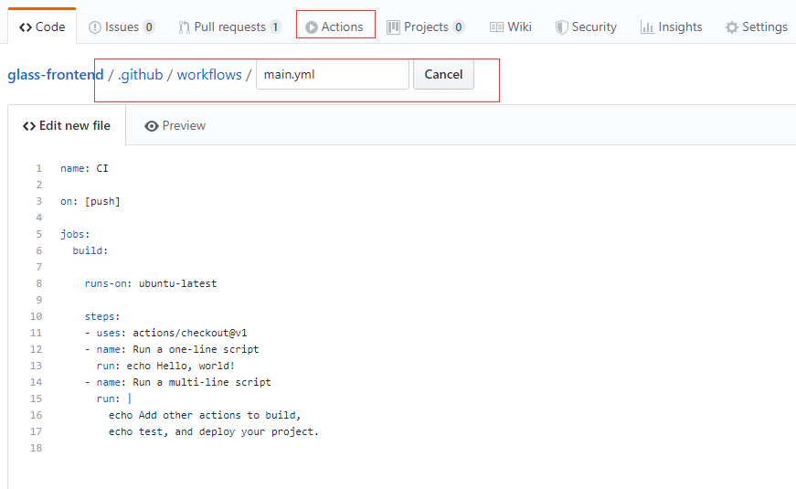
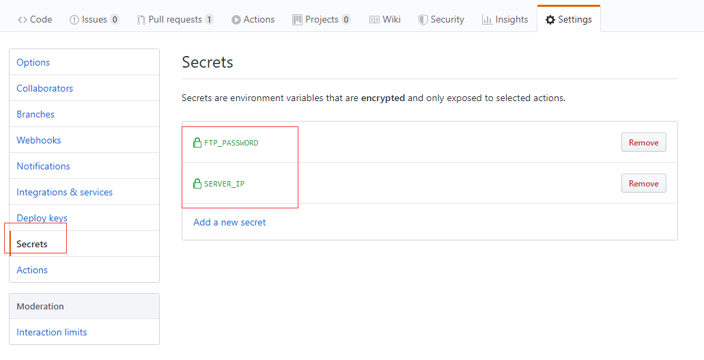

Github Actions是github搞的一个持续集成服务,现在还在测试中,如果想要使用需要到官网去申请.

现在我想使用github actions实现vue-element-admin做的一个管理后台的自动构建发布到生产服务器的一系列过程


## 新建github workflow



进入github仓库的主页点击actions就可以创建一个新的workflow

新建文件的路径在仓库根目录的./github/workflows/

我之前误操作不知道为什么新建在仓库的根目录


## 字段说明

* `name`  字段是 workflow 的名称。如果省略该字段，默认为当前 workflow 的文件名 

  ```yaml
  name: CI
  ```

* `on` 字段指定触发 workflow 的条件

  ```yaml
  //push时触发
  on: [push]
  //push和pull时触发
  on: [push, pull_request]
  //只在master分支push时触发
  on:
    push:
      branches:    
        - master
  ```

* `jobs` 表示要执行的一项或多项任务 

  ```yaml
  jobs: 
  	my_job1:
  		xxxxxxx
  		xxxx
  	my_job2: 
  		xxxxx
  		xxx
  ```

  my_job1和my_job2称为job_id

* `jobs.<job_id>.runs-on`  字段指定运行所需要的虚拟机环境。它是必填字段。目前可用的虚拟机如下 
  - `ubuntu-latest`，`ubuntu-18.04`或`ubuntu-16.04`
  - `windows-latest`，`windows-2019`或`windows-2016`
  - `macOS-latest`或`macOS-10.14`

* `jobs.<job_id>.steps` 字段指定每个 Job 的运行步骤，可以包含一个或多个步骤。每个步骤都可以指定以下字段
  * `steps.name`：步骤名称 
  
  * `steps.run`：该步骤运行的linux命令 如`pwd` `ls-l` 等
  
  * `steps.uses` :该步骤使用[actions market]( https://github.com/marketplace?type=actions )中的别人写好的action
  
  * `steps.uses.with`:该步骤是填入别人定义好的参数,比如在hellow_action中定义好了三个参数( `first_name`, `middle_name`, and `last_name` )
  
    ```yaml
    jobs:
      my_first_job:
        steps:
          - name: My first step
            uses: actions/hello_world@master
            with:
              first_name: Mona
              middle_name: The
              last_name: Octocat  
    ```

	 * `steps.uses.env`和`with`类似

## 我的action

### 下载项目代码

```yaml
uses: actions/checkout@master
```
@master是指定master的代码
如果想要下载某个tag或某个commit的代码,如下

```yaml
actions/checkout@74bc508 # 指向一个 commit
actions/checkout@v1.0    # 指向一个标签
actions/checkout@master  # 指向一个分支
```

### npm build

```yaml
- name: npm install, build, and test
  run: |
     npm install
     npm run build:prod --if-present
  env:
     CI: true
```

### ssh到生产服务器备份现在正在运行的静态网页

这一部使用了appleboy的ssh-action,这个action就是从action market中找到的
具体文档[在这]( https://github.com/appleboy/ssh-action )

```yaml
  name: backup admin-web
  uses: appleboy/ssh-action@master
  with:
       host: ${{ secrets.SERVER_IP }}
       username: root
       password:  ${{ secrets.FTP_PASSWORD }}
       port: 22
       script: |
         cp -r /root/glass/admin-web /root/glass/admin-web-old
```


如果actions的配置文件里重要的信息,比如密码或密钥可以使用秘密环境变量来替代`${{secrets.xxxx}}`



### 把dist部署到生产服务器

vue-element-admin build之后的静态文件在根目录的dist文件夹,所以我要把dist文件夹内的文件都上穿到生产服务器里

这里使用了SamKirkland/FTP-Deploy-Action@2.0.0     [文档]( https://github.com/SamKirkland/FTP-Deploy-Action ) 

```yaml
        uses: SamKirkland/FTP-Deploy-Action@2.0.0
        env:
          FTP_SERVER: ${{ secrets.SERVER_IP }}
          FTP_USERNAME: root
          FTP_PASSWORD: ${{ secrets.FTP_PASSWORD }}
          METHOD: sftp
          LOCAL_DIR: dist   #要上传的目录
          REMOTE_DIR: /root/glass/admin-web  #上传到服务器的目录
          ARGS: --delete
```

## 全部action文件


```yaml
name: Node CI

on:
  push:
    branches:
      - master

jobs:
  build:
    runs-on: ubuntu-latest

    steps:
      - uses: actions/checkout@master

      - name: Use Node.js 12.x
        uses: actions/setup-node@v1
        with:
          node-version: '12.x'
      - name: npm install, build, and test
        run: |
          npm install
          npm run build:prod --if-present
        env:
          CI: true

      - name: backup admin-web
        uses: appleboy/ssh-action@master
        with:
          host: ${{ secrets.SERVER_IP }}
          username: root
          password:  ${{ secrets.FTP_PASSWORD }}
          port: 22
          script: |
            cp -r /root/glass/admin-web /root/glass/admin-web-old
      - name: deploy to server
        uses: SamKirkland/FTP-Deploy-Action@2.0.0
        env:
          FTP_SERVER: ${{ secrets.SERVER_IP }}
          FTP_USERNAME: root
          FTP_PASSWORD: ${{ secrets.FTP_PASSWORD }}
          METHOD: sftp
          LOCAL_DIR: dist
          REMOTE_DIR: /root/glass/admin-web
          ARGS: --delete
```

运行结果


## 参考

*  https://help.github.com/en/github/automating-your-workflow-with-github-actions/virtual-environments-for-github-actions 
*  https://github.com/SamKirkland/FTP-Deploy-Action 
*  https://github.com/appleboy/ssh-action 