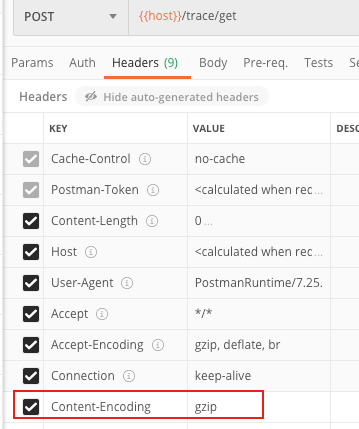

最近需要测试gzip相关的内容。其中有一项需要对经过gzip压缩的request body进行处理。平时测试接口都是使用postman，这次我也希望用postman来完成


## 实现

* 首先请求的header中必须有`Content-Encoding=gzip`，如图所示



* 想要使用postman发送gzip压缩的请求，只能通过发送文件的方式。所以要先把要发送的内容生成gzip文件

  ```go
  func TestGzip(t *testing.T) {
  	var b bytes.Buffer
  	w := gzip.NewWriter(&b)
  	_, _ = w.Write([]byte("gzip content......."))
  	_ = w.Close()
  	fmt.Println(ioutil.WriteFile("./gzip.txt", b.Bytes(), os.FileMode(0777)))
  }
  ```

  上面的go程序就是把`gzip content.....`这个string压缩为gzip文件

  

* 然后在body选项中选择binary类型，选择上一步生成的文件。点击发送

  

