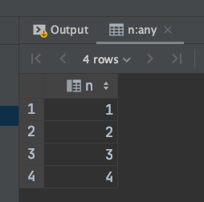
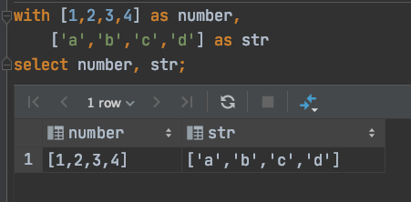
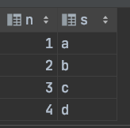
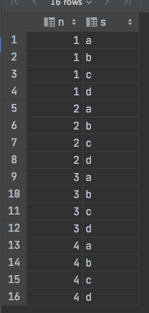
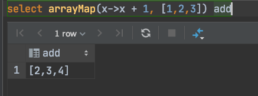
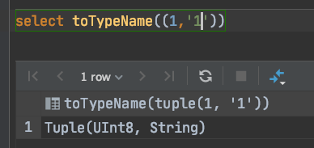
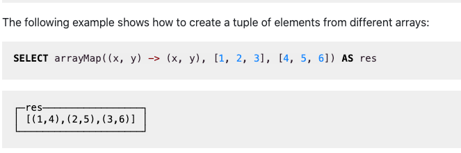
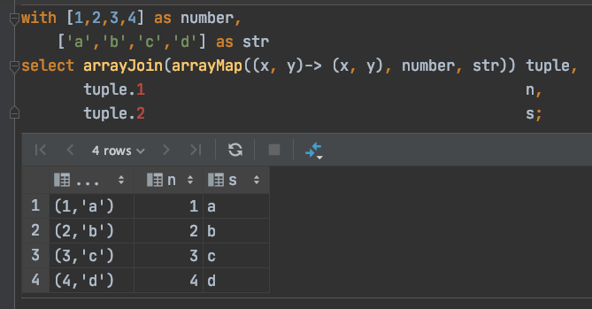

在 clickhouse 中经常遇到把数组转为列的情况 . 

## 一个数组转为列

一个数组转列的情况很简单 , 直接使用 `arrayjoin` 函数来实现

```sql
select arrayJoin([1,2,3,4]) n
```




## 两个数组转为两列遇到的问题

现有两个数组 , 想要把这两个数组转为两列 .  比如


   变为   


按照上面的经验分别对这两个数组使用 `arrayjoin`  , 但是结果明显不符合我预期

```sql
with [1,2,3,4] as number,
    ['a','b','c','d'] as str
select arrayJoin(number) n, arrayJoin(str) s;
```



clickhouse 明显是把两列做了笛卡尔积

## 解决问题

这时可以用 clickhouse 的高级函数 `arraymap` 和 `tuple` 配合来实现这个变换

arraymap 的效果和 java8 里的 map 是一样的 . 即对数组的每一个元素做处理然后返回一个新的数组





上图就是对 `[1,2,3]` 数组进行加一 , 然后返回 `[2,3,4]`

`tuple` 里可以装不同类型的数据 , 下图就是把一个 int 和一个 string 放在了一个 `tuple` 里





关于 `tuple` 更多的操作可以查阅[官方文档](https://clickhouse.tech/docs/en/sql-reference/data-types/tuple/)


arrymap 不光可以对一个数组进行操作 , 还可以把不同的数组放到一个 tuple 数组中 . 官方文档的示例如下 :





这种方法就能实现我们的目标



\

`tuple.1` 就是引用 tuple 内第一个元素 , 这里也看出 clickhouse 的索引下标是从 1 开始的


## 结果

最后结果就是通过 arraymap 和 tuple 配合来实现

sql 如下

```sql
with [1,2,3,4] as number,
    ['a','b','c','d'] as str
select arrayJoin(arrayMap((x, y)-> (x, y), number, str)) tuple,
       tuple.1                                           n,
       tuple.2                                           s;
```

