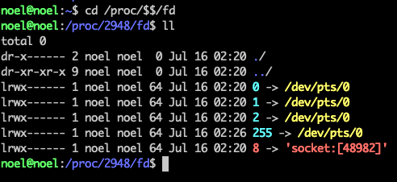
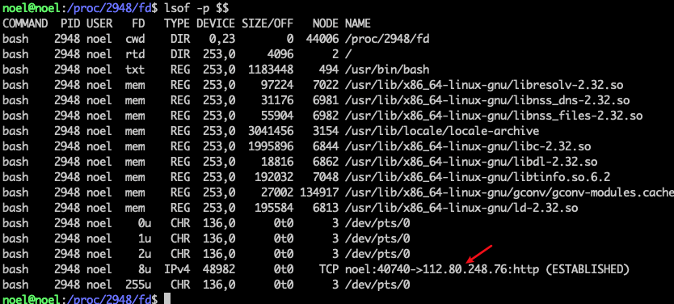
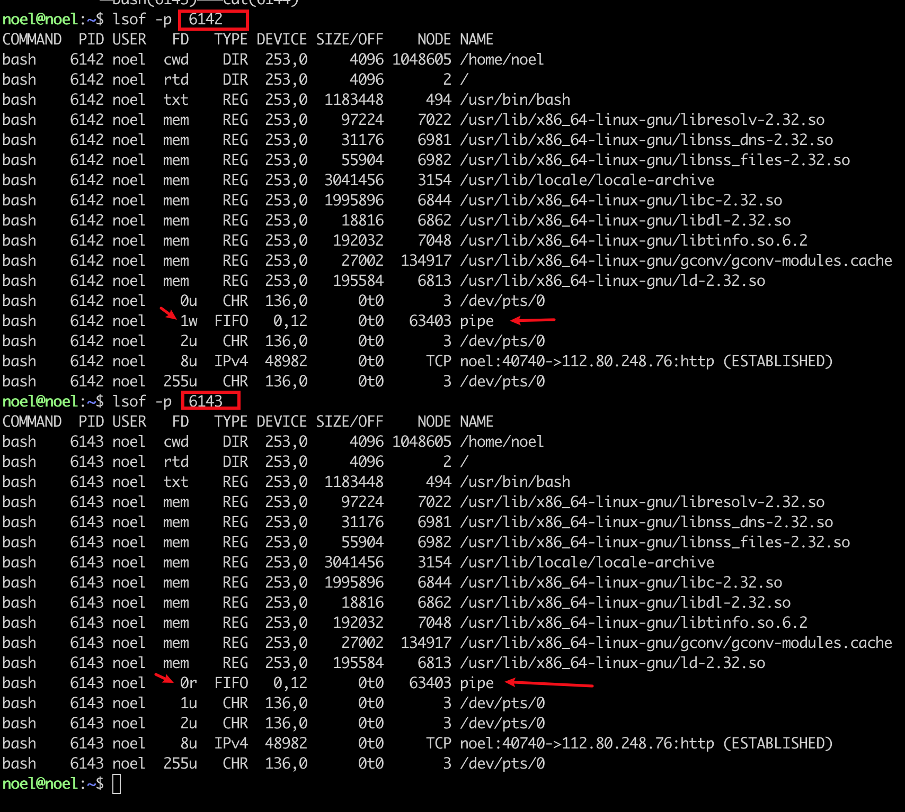
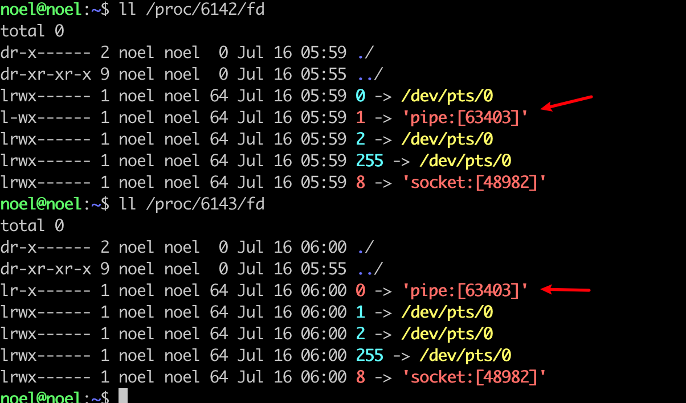

## 前置知识

### `$$` 和 `$BASHPID` 的用处和区别

`$$` 和 `$BASHPID` 都是打印当前 bash 进程的进程编号，在下面的例子两者是没有区别的，输出结果相同

```bash
noel@noel:~$ echo $$
2948
noel@noel:~$ echo $BASHPID
2948
```


但是在下面的例子下又不同

```bash
noel@noel:~$ { echo $$; read a;} | { cat; }
2948

noel@noel:~$ { echo $BASHPID; read a;} | { cat; }
3898
```

在 linux 中，管道(`|`)的两侧是通过两个子进程来分别执行的。`$$` 在哪个进程中执行命令，该值就是哪个进程的PID。`$BASHPID` 就是当前进程的 PID 真实值（当前执行的命令的 PID）。

由于 `{ echo $BASHPID; read a;} | { cat; }`  命令是由两个子进程来执行，所以 `echo $BASHPID` 打印的是子进程的 pid。


## socket 文件类型

可以使用 `exec 8<> /dev/tcp/www.baidu.com/80` 在当前 bash 中打开一个 socket 文件类型

可以通过下面两种方式来验证







## pipe 文件类型

linux 中的管道是进程间通信的一种方式，管道都是一端写入、另一端读取，它们是单方向数据传输的，它们的数据都是直接在内存中传输的。管道也是 linux 其中一种文件类型。 下面演示下如何观察 linux 下的 pipe 文件类型


* 查询下当前的 bash 的 pid

```bash
noel@noel:~$ echo $$
2948
```

* 执行下面的命令，会阻塞住

```bash
noel@noel:~$ { echo $BASHPID; read a; } | { cat ; echo $BASHPID; read y; }
6142

```

* 新开一个 bash 然后通过 `pstree` 命令查看之前 bash 的进程树

```bash
noel@noel:~$ pstree -p 2948
bash(2948)─┬─bash(6142)
           └─bash(6143)───cat(6144)
```

* 可以看到 2948 有两个子进程，分别是 6142 和 6143。我们通过 lsof 来观察下



上面的命令可以看出 6142 进程下有一个写入的 pipe ，6143 进程下有个读取的 pipe


* 通过 `/prod/$pid/fd` 下的文件也可以查看

  
