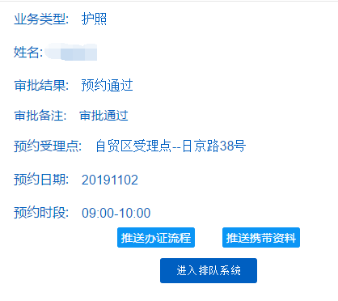
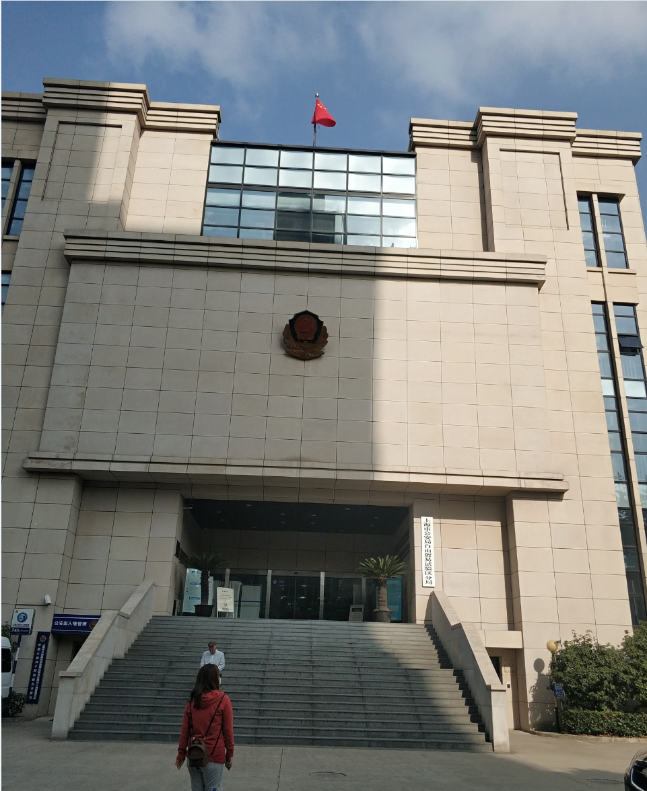
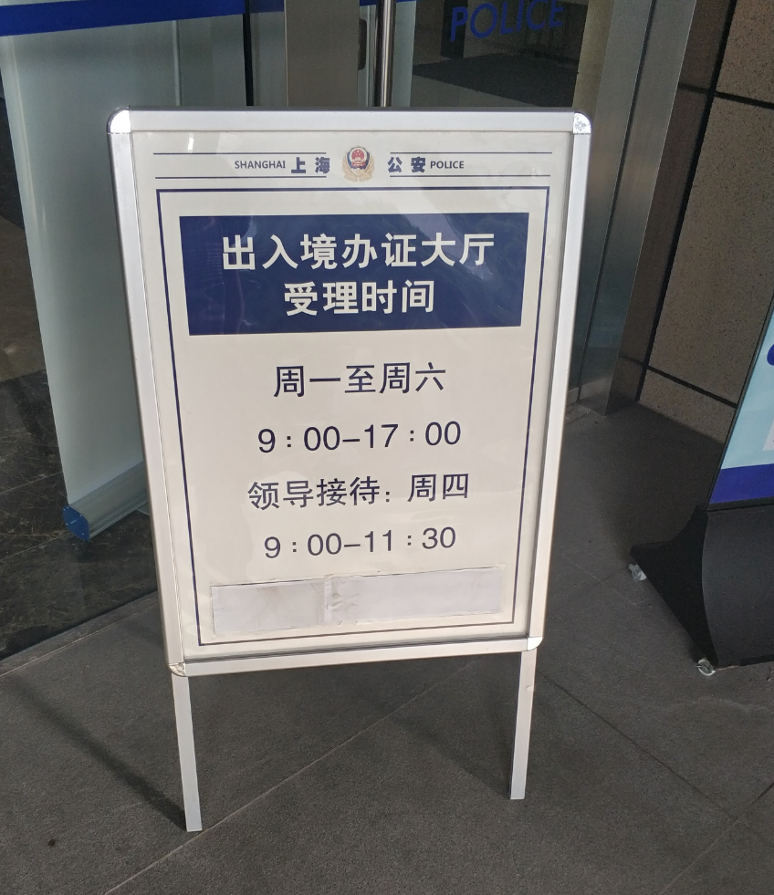
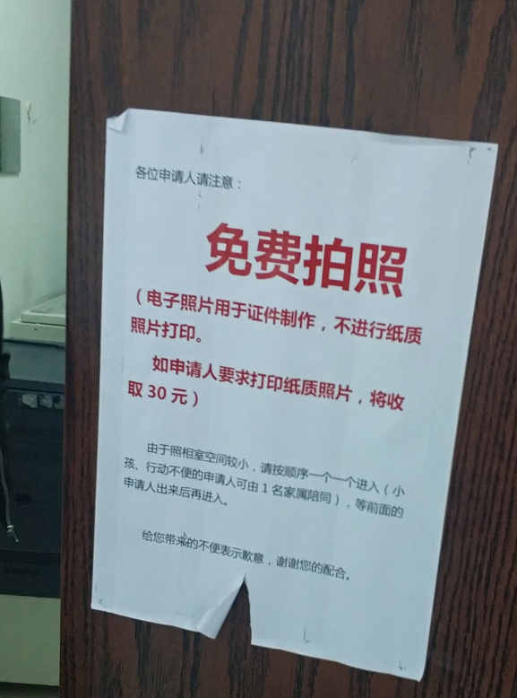

# 上海办理护照流程

## 前言

我办理护照并不是因为目前有出过国的需求。而是国外的一些平台的身份认证需要上传护照，中国居民身份证在国外平台的认可度是没有护照高的。所以现在闲着没事办个护照，以备不时之需。

## 必要条件和证件

在上海办理护照要满足以下三个条件其中之一

* 上海户籍
* 上海居住证
* 在上海**连续**缴纳一年社保

我就是以第三个条件来办理的护照

证件只需要**身份证**

## 办理流程

### 预约

预约有两种方式一种是提前网上预约([点击进入预约网址](<https://gaj.sh.gov.cn/crj/zggmCX.jsp>))。第二种是到现场扫码预约

我是提前在网上预约的

预约的地址是自贸区的日京路38号，时间段上午9：00-10：00

### 办理前

日京路的办理点是在二楼，由台阶上去，进入大门进去就是办理大厅

办公时间

办理大厅内

### 拍照

如果提前预约了，可以直接去拍照，如果没预约过要到前台扫码预约。

如果只是办理护照，拍照是免费的。如果还要办理签证，需要另付30元打印照片，支持支付宝微信

### 打印申请表

拍完照片后，去旁边的机器打印申请表，这里需要身份证。

拿到申请表后找前台取号排队。这里可以选择邮寄证件，邮费是到付。

### 办理付款

拿到号后，就可以坐着休息了。叫到你时去对应的窗口办理就行了。

办理过程就是核对信息，录入指纹签字这几项，速度很快。

最后就是付费了，办证的费用120元，支持现金、支付包微信、银行卡、信用卡。

最后把申请表，快递单号交给前台，流程结束。

## 总结

从我进入办理大厅，到办理完成走出大厅，全程花费了我22分钟🙂和120元和少许的邮费

整个流程非常的快捷方便👍
