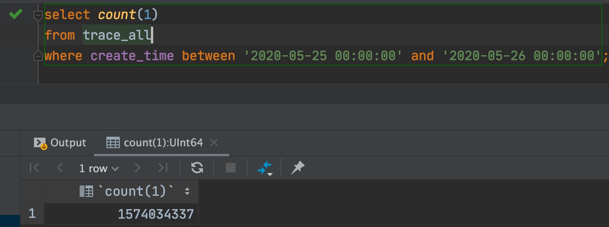
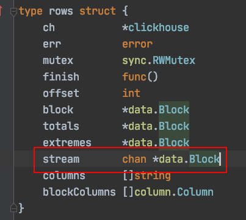
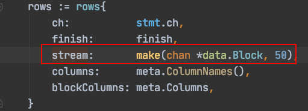

# golang处理数据库返回大量数据


## 问题

这两天需要把ClickHouse的查询结果进行统计然后存储起来，但是每一次查询的出来的数据量非常大。行数很多，某一天的count统计如下：



每次查询的数据有上亿行😢。在ClickHouse查询出结果后返回给client(就是我写的程序)，但是由于这个任务是在k8s内运行，限制只有400m的内存。所以很快就因为内存溢出而崩溃。

## 之前的代码

一般的情况下都是把查询结果都放到slice内再返回比如这样：

```go
	for scanner.Next() {
					value := reflect.New(base)
					if values, err := mapStructFieldsIntoSlice(value, columns, strict); err != nil {
						return err
					} else {
						if err := scanner.Scan(values...); err != nil {
							return err
						} else {
							appendFn(value)
						}
					}
				}
```

上面代码循环调用next方法，然后把读取的一行行数据放到slice中，这样很快就内存溢出了。

但是ClickHosue的drive内并不是一下就把所有的数据取回，而是维护一个stream。

当调用`rows.next()`时Clickhouse实现的Rows对象会从stream中读取一个block：


让我们看看stream的定义：





stream就是一个容量为50的channel，也就是说当我们不执行next时，stream最多有50行的查询结果，这样就避免的了返回大量的查询结果而造成的崩溃。

## 解决

通过上面的分析，我们也可以使用chan来解决

```go
func BatchScanRows(db *sql.DB, ch chan interface{}, dest interface{}, query string, args ...interface{}) error {
  .....
  省略部分代码
  .......
  go func() {
		defer close(ch)

		for rows.Next() {
			v := reflect.New(itemType)
			err := rows.Scan(span(v.Interface(), columnIdx)...)
			if err != nil {
				logx.Error(err)
				break
			}
			ch <- v.Interface()
		}
	}()

	return nil
}
```

使用chan来接收rows.next的返回，这个chan我设置的大小是50000。然后再启动一个goroutine异步执行，保证立即返回。

```go
func queryCH(heraCH *sql.DB, startStr string, endStr string) (map[int]statInfo, error) {
	chSQL := `select * from xxx`
	weeklyInfos := []*weeklyInfo{}
	ch := make(chan interface{}, 50000)
	err := ckgroup.BatchScanRows(heraCH, ch, &weeklyInfos, chSQL, startStr, endStr)
	if err != nil {
		if err == sqlx.ErrNotFound {
			return nil, nil
		}
		return nil, err
	}
	statMap := map[int]statInfo{}
  //循环读取chan，直到chan close
	for data := range ch {
		v := data.(*weeklyInfo)
		weeklyId, err := getWeeklyId(v.Path)
		if err != nil {
			logx.Error(err)
			continue
		}
		statInfoItem := statMap[weeklyId]
		statInfoItem.ViewCount++
		statInfoItem.ViewTotal += int64(v.StayTime)
		statMap[weeklyId] = statInfoItem
	}
	return statMap, nil
}
```

这样就能边处理边从Clickhouse的服务器中取数据
