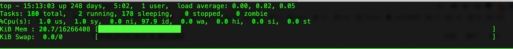

# linux的top命令如何保存设置

## 问题

linux的top命令的默认显示方式不是很直观。比如内存的显示方式是以字节为单位；每次刷新的间隔太慢；多个cpu核心没有全部显示等。每次进入top的界面都要设置一阵子才能舒适的使用。但是每次都要设置就很麻烦，所以这篇文章就是来展示我的top命令的一些设置以及如果保存这些设置。

## 如何保存设置

使用大写的`W`来保存自定义的设置，按下W后top界面上会显示设置保存的路径，如下图所示

## 个人设置

下面是我的一些个性化设置

#### 内存为MB为单位显示

按多次`e`切换各个进程的内存单位

按多次`E`切换概览信息的内存单位，调整前后的效果如下所示

调整前：

调整后：

#### 刷新频率

top的默认频率好像是3s，有时做压力测试的时候需要更高频的变化。输入`d`来修改频率，填入数字后，回车键确定。单位为秒，支持小数。我的频率是0.3秒

下图就是从3秒改为0.3秒

#### 显示全部的cpu

按数字`1`来显示多个核心的cpu

效果如图

#### 修改内存占用的进度条

按多次`m`来修改

修改前

修改后

我比较喜欢这种显示方式，感觉比较直观，能够直观看出内存的大体占用情况

## 参考

* https://haydenjames.io/linux-top-customize-it/
