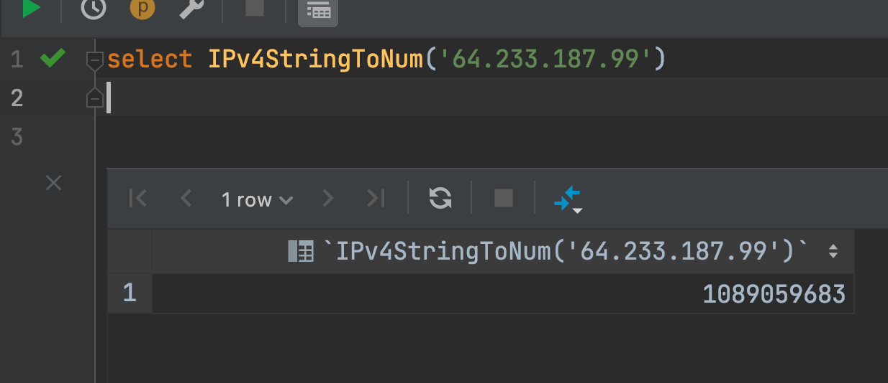

# clickhouse 比较版本号


## 2021-01-15 日更新
最近发现 `IPv4StringToNum` 是用来比较版本号是更简单，性能更好的方式。

```sql
select IPv4StringToNum('2.7.14.23') < IPv4StringToNum('2.12.8.12') comparse;
```

上面的结果是 `1` 符合我们的预期

但是这个函数有个缺点，版本号必须符合 ipv4 的格式，否者 `IPv4StringToNum` 会直接返回`0`

但巧合的是目前我们业务的版本号就是 `1.2.3.4` 这种格式，正巧符合 ipv4。

#### 版本号预处理

对于不符合 ipv4 的版本号可以稍微处理下，比如只有两位（`1.2`）或三位的版本号（`1.2.3`）要补全成 ipv4 的形式

```sql
with '1.2' as shortVersion
select concat(shortVersion, repeat('.0', toUInt64(4 - length(splitByString('.', shortVersion)))));
```


#### 原理

clickhouse 是如何把 ipv4 的字符串变为 number 的？经过查询找到了 clickhouse 的计算流程

比如一个形如`64.233.187.99`的 ipv4 地址，会经过如下的计算

```
64*2^24 + 233*2^16 + 187*2^8 + 99
= 1089059683
```

这和 clickhouse 的结果完全一致




## 以下为原文章


如果想要比较两个版本号的字符串, 比如 `select '5.6.8.10'>'5.6.8.2'`  结果肯定是`0`即后者比较大, 但是在版本号的语义中明明是前者比较大. 在 mysql 中已经有了解决方案, 但是在 clickhouse 中我还没有在网络上搜索到. 但是可以借用 mysql 的思路来解决


## 思路

* 把版本号按`.`分割, 返回一个字符串数组. 使用 `splitByString` 函数来分割  
* 然后对数组每一个元素填充字符 `'0'` 使每一个元素都是 10 位, 比如上一步得到的字符串数组是` ['5','6','8','10']`. 那么填充结果是 `['0000000005','0000000006','0000000008','0000000010']` . 这一步可以使用 `arrayMap` 函数来操作数组内每一个元素.  `arrayMap` 的详细使用方法可以参考[官方文档](https://clickhouse.tech/docs/en/sql-reference/functions/higher-order-functions/#higher_order_functions-array-map)

* 然后把上一步得到的新数组拼接为一个完整的字符串, 可以使用 `arrayStringConcat` 函数来完成. 这一步的结果为`0000000005000000000600000000080000000010`

* 然后可以拿上一步拼接的字符串直接比较了


## 完整的 sql

```sql
with arrayStringConcat(arrayMap(x -> concat(repeat('0', toUInt16(10 - length(x))), x),
                                splitByString('.', '5.6.8.10')), '') as ver1,
    arrayStringConcat(arrayMap(x -> concat(repeat('0', toUInt16(10 - length(x))), x),
                               splitByString('.', '5.6.8.2')), '') as ver2

select ver1 > ver2;
```


## 参考

* https://tiramisu-navy.github.io/2018/09/27/mysql-compare-version(varchar)/
* https://clickhouse.tech/docs/en/sql-reference/functions/higher-order-functions/#higher_order_functions-array-map
* https://stackoverflow.com/questions/34876711/mysql-query-compare-version-numbers
