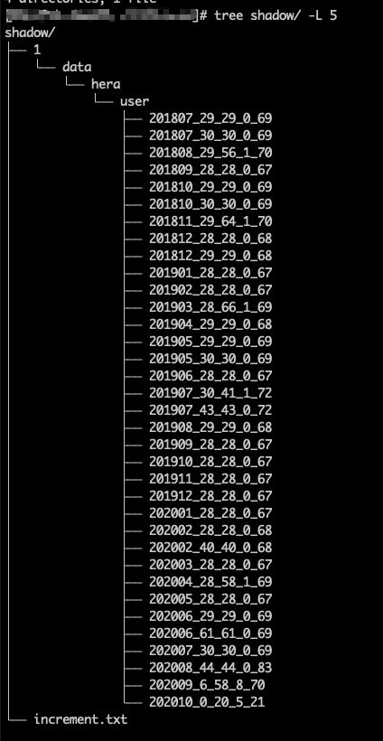

# ClickHouse 重建 zookeeper 里的元数据(ClickHouse 恢复数据)


## 问题

今天在修改 ClickHouse 集群数据库表结构的时候 , 不知道由于什么原因 , 造成有两个节点 ( A 和 B , 其中 B 是副本节点 ) 的 zookeeper 的 metadata 数据不一致 

每次在两个节点执行 `alter table` 的语句都会报  `Metadata on replica is not up to date with common metadata in Zookeeper`  错误 

一开始的想法是把 A B 节点的 zookeeper 内的 `columns` 的值改成一样的就行了 . 没想到改了之后还是这个错 . 没办法 , 只能重建 zookeeper 上的 metadata 数据 (只重建出问题的表 , 其他的表不动)

>	注意 : 下面所有的操作没有特别的说明都是在 A 节点上进行的


## 备份数据

数据数据时有两个情况 :

#### ClickHouse 在运行中

>  关于 `freeze  `具体的说明可以参考[官方文档](https://clickhouse.tech/docs/en/sql-reference/statements/alter/partition/#alter_freeze-partition)

```sql
ALTER TABLE $tab FREEZE
```

* 这个语句是在 ClickHouse 运行的情况下产生一份 `$tab` 这个表的数据备份
* 备份的数据的数据在 `$ck主目录/shadow/$N/data/....` 中
* 路径中的 `$N`  是个变量 , 表示备份次数 , 如果是第一次运行那么值就是 `1`

例如 : 

```sql
alter table hera.user freeze;
```

运行上面的语句后 , 进入对应的目录运行 `tree` 命令看下结果 



`user` 目录下就是备份的各个 partition 数据

#### ClickHouse 已经停止运行了

直接进入 data 目录把数据复制一份到其他目录

使用这种方式一定要确保 Clickhouse 已经停止运行 , 要不然备份的数据会有损坏的风险


## 恢复数据
#### 建临时表

 ```sql
  create table hera.temp  (.....)
 ```


#### 把上一步备份的数据转移到或复制到临时表的 `detached` 目录里

```shell
mv或cp /ck/shadow/1/data/hera/user/*  /ck/data/hera/temp/detached
chown clickhouse:clickhouse -R /ck/data/hera/temp/detached
```

上面的第二行是确保 `detacehd`目录下的所有文件的用户和组是 `clickhouse` 要不然有权限问题


#### 恢复 A 节点数据

```shell
cd /ck/data/hera/temp/detached
let i=1;for f in `ls -1` ; do echo $i $f;((i++)); echo "alter table hera.temp attach part '$f';"|clickhouse-client ; done
```

这一步是把备份的数据 attach 到 `temp` 表中

这一步完成后 A 节点的数据恢复就完成了


#### 恢复 B 节点数据

在 B 节点上也建立一个临时表 , ClickHouse 自动会从 A 节点上拉取数据


## 扫尾工作

* 在 A B 节点上 `drop ` 掉zookeeper 不一致的表

```sql
drop table user
```
* 在 A B 节点上把 temp 表的名字修改为原表的名字
```sql
rename temp to user
```


## 参考

* https://github.com/ClickHouse/ClickHouse/issues/7972
* https://clickhouse.tech/docs/en/sql-reference/statements/alter/partition/#alter_freeze-partition
